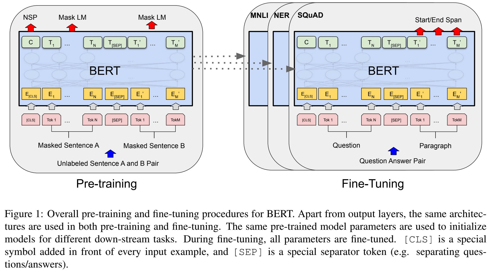

bert出现之前，还没有一个NLP的神经网络训练好后，可以在其他NLP任务上应用。

BERT ： Pre-training of Deep Bidirectional Transformers for Language Understanding

- pre-training  在一个数据集上训练好一个模型，在别的任务上做training。
- Bidirectional 双向的
- Language Understanding 比transformer用在机器翻译上，应用更为广泛
- transformer 主要用在机器翻译上

# 0 Abstract

We introduce a new language representation model called BERT, which stands for Bidirectional Encoder Representations from Transformers. Unlike recent language representation models (Peters et al., 2018a; Radford et al., 2018), BERT is designed to pretrain deep bidirectional representations from unlabeled text by jointly conditioning on both left and right context in all layers. As a result, the pre-trained BERT model can be finetuned with just one additional output layer to create state-of-the-art models for a wide range of tasks, such as question answering and language inference, without substantial taskspecific architecture modifications.

我们引入了一种称为 BERT 的新语言表示模型，它代表来自 Transformers 的双向编码器表示。
与最近的语言表示模型 (Peters et al., 2018a; Radford et al., 2018) 不同，BERT 旨在通过联合调节所有层的左右上下文来预训练来自未标记文本的深度双向表示。
因此，预训练的 BERT 模型可以通过一个额外的输出层进行微调，从而为各种任务（例如问答和语言推理）创建最先进的模型，而无需对特定于任务的架构进行大量修改。

BERT is conceptually simple and empirically powerful. It obtains new state-of-the-art results on eleven natural language processing tasks, including pushing the GLUE score to 80.5% (7.7% point absolute improvement), MultiNLI accuracy to 86.7% (4.6% absolute improvement), SQuAD v1.1 question answering Test F1 to 93.2 (1.5 point absolute improvement) and SQuAD v2.0 Test F1 to 83.1 (5.1 point absolute improvement).

BERT 在概念上很简单，在经验上很强大。
它在 11 个自然语言处理任务上获得了新的 state-of-the-art 结果，包括将 GLUE 分数推至 80.5%（7.7% 点的绝对改进），MultiNLI 准确度达到 86.7%（4.6% 的绝对改进），SQuAD v1.1问答测试 F1 到 93.2（1.5 分绝对提高）和 SQuAD v2.0 测试 F1 到 83.1（5.1 分绝对提高）。
【注】在讲一个东西好的时候，一方面讲绝对的精度是多少，另一方面讲相对的提升的精度是多少。

# 1 Introduction

Language model pre-training has been shown to be effective for improving many natural language processing tasks (Dai and Le, 2015; Peters et al., 2018a; Radford et al., 2018; Howard and Ruder, 2018). These include sentence-level tasks such as natural language inference (Bowman et al., 2015; Williams et al., 2018) and paraphrasing (Dolan and Brockett, 2005), which aim to predict the relationships between sentences by analyzing them holistically, as well as token-level tasks such as named entity recognition and question answering, where models are required to produce fine-grained output at the token level (Tjong Kim Sang and De Meulder, 2003; Rajpurkar et al., 2016).

语言模型预训练已被证明可有效改善许多自然语言处理任务（Dai 和 Le，2015；Peters 等人，2018a；Radford 等人，2018；Howard 和 Ruder，2018）。 
其中包括**句子级任务**，例如自然语言推理（Bowman 等人，2015；Williams 等人，2018）和释义（Dolan 和 Brockett，2005），旨在通过整体分析来预测句子之间的关系，如 以及**词元级别**的任务，例如命名实体识别和问答，其中需要模型在词源元级别产生细粒度的输出（Tjong Kim Sang 和 De Meulder，2003；Rajpurkar 等人，2016）。

There are two existing strategies for applying pre-trained language representations to downstream tasks: feature-based and fine-tuning. The feature-based approach, such as ELMo (Peters et al., 2018a), uses task-specific architectures that include the pre-trained representations as additional features. The fine-tuning approach, such as the Generative Pre-trained Transformer (OpenAI GPT) (Radford et al., 2018), introduces minimal task-specific parameters, and is trained on the downstream tasks by simply fine-tuning all pretrained parameters. The two approaches share the same objective function during pre-training, where they use unidirectional language models to learn general language representations.

将预训练的语言表示应用于下游任务有两种现有策略：**基于特征**和**微调**。
基于特征的方法，例如 ELMo (Peters et al., 2018a)，使用特定于任务的架构，其中包括预训练的表示作为附加特征。
微调方法，例如 Generative Pre-trained Transformer (OpenAI GPT) (Radford et al., 2018)，引入了最少的任务特定参数，并通过简单地微调所有预训练参数来对下游任务进行训练。
这两种方法在预训练期间共享相同的目标函数，它们使用单​​向语言模型来学习通用语言表示。

We argue that current techniques restrict the power of the pre-trained representations, especially for the fine-tuning approaches. The major limitation is that standard language models are unidirectional, and this limits the choice of architectures that can be used during pre-training. For example, in OpenAI GPT, the authors use a left-to-right architecture, where every token can only attend to previous tokens in the self-attention layers of the Transformer (Vaswani et al., 2017). Such restrictions are sub-optimal for sentence-level tasks, and could be very harmful when applying fine-tuning based approaches to token-level tasks such as question answering, where it is crucial to incorporate context from both directions.

我们认为，当前的技术限制了预训练表示的能力，特别是对于微调方法。
主要限制是标准语言模型是单向的，这限制了可在预训练期间使用的架构的选择。
例如，在 OpenAI GPT 中，作者使用从左到右的架构，其中每个标记只能关注 Transformer 的自注意力层中的先前标记（Vaswani 等人，2017）。
这样的限制对于句子级任务来说是次优的，并且在将基于微调的方法应用于令牌级任务（例如问答）时可能非常有害，在这些任务中，从两个方向结合上下文至关重要。

In this paper, we improve the fine-tuning based approaches by proposing BERT: Bidirectional Encoder Representations from Transformers. BERT alleviates the previously mentioned unidirectionality constraint by using a “masked language model” (MLM) pre-training objective, inspired by the Cloze task (Taylor, 1953). The masked language model randomly masks some of the tokens from the input, and the objective is to predict the original vocabulary id of the masked word based only on its context. Unlike left-to-right language model pre-training, the MLM objective enables the representation to fuse the left and the right context, which allows us to pretrain a deep bidirectional Transformer. In addition to the masked language model, we also use a “next sentence prediction” task that jointly pretrains text-pair representations. The contributions of our paper are as follows:
- We demonstrate the importance of bidirectional pre-training for language representations. Unlike Radford et al. (2018), which uses unidirectional language models for pre-training, BERT uses masked language models to enable pretrained deep bidirectional representations. This is also in contrast to Peters et al. (2018a), which uses a shallow concatenation of independently trained left-to-right and right-to-left LMs.
- We show that pre-trained representations reduce the need for many heavily-engineered taskspecific architectures. BERT is the first finetuning based representation model that achieves state-of-the-art performance on a large suite of sentence-level and token-level tasks, outperforming many task-specific architectures.
- BERT advances the state of the art for eleven NLP tasks. The code and pre-trained models are available at https://github.com/ google-research/bert.

在本文中，我们通过提出 BERT：Transformers 的双向编码器表示来改进基于微调的方法。 BERT 通过使用受完形填空任务 (Taylor, 1953) 启发的“掩码语言模型” (MLM) 预训练目标来缓解前面提到的单向性约束。掩码语言模型从输入中随机掩码一些标记，目标是仅根据上下文预测掩码单词的原始词汇 id。与从左到右的语言模型预训练不同，MLM 目标使表示能够融合左右上下文，这使我们能够预训练深度双向 Transformer。除了掩码语言模型之外，我们还使用了“下一句预测”任务，该任务联合预训练文本对表示。我们论文的贡献如下：
- 我们展示了双向预训练对语言表示的重要性。与 Radford 等人不同。 (2018) 使用单向语言模型进行预训练，BERT 使用掩码语言模型来实现预训练的深度双向表示。这也与彼得斯等人相反。 （2018a），它使用独立训练的从左到右和从右到左 LM 的浅连接。
- 我们表明，预训练的表示减少了对许多精心设计的任务特定架构的需求。 BERT 是第一个基于微调的表示模型，它在大量句子级和令牌级任务上实现了最先进的性能，优于许多特定于任务的架构。
- BERT 提升了 11 个 NLP 任务的最新技术水平。代码和预训练模型可在 https://github.com/google-research/bert 获得。

* alleviate
  * v. 减轻，缓和
* token
  * n. （某些机器中用以代替纸币的）代币，专用辅币；象征，标志；礼券，代金券；（语言学）符号；（计算机）令牌，记号；（火车通行的）路签
  * adj. 装点门面的，装样子的；象征性的，作为标志的

# 2 Related Work
## 2.1 Unsupervised Feature-based Approaches
## 2.2 Unsupervised Fine-tuning Approaches
## 2.3 Transfer Learning from Supervised Data

# 3 BERT

We introduce BERT and its detailed implementation in this section. There are two steps in our framework: pre-training and fine-tuning. During pre-training, the model is trained on unlabeled data over different pre-training tasks. For fine-tuning, the BERT model is first initialized with the pre-trained parameters, and all of the parameters are fine-tuned using labeled data from the downstream tasks. Each downstream task has separate fine-tuned models, even though they are initialized with the same pre-trained parameters. The question-answering example in Figure 1 will serve as a running example for this section.

我们在本节介绍 BERT 及其详细实现。
我们的框架有两个步骤：**预训练**和**微调**。
在**预训练**期间，该模型通过不同的预训练任务在未标记数据上进行训练。
对于**微调**，BERT 模型首先使用预训练的参数进行初始化，然后使用来自下游任务的标记数据对所有参数进行微调。
每个下游任务都有单独的微调模型，即使它们使用相同的预训练参数进行初始化。
图 1 中的问答示例将作为本节的运行示例。

A distinctive feature of BERT is its unified architecture across different tasks. There is minimal difference between the pre-trained architecture and the final downstream architecture.

BERT 的一个显着特点是其跨不同任务的统一架构。 预训练的架构和最终的下游架构之间的差异很小。

Model Architecture

BERT’s model architecture is a multi-layer bidirectional Transformer encoder based on the original implementation described in `Vaswani et al. (2017)` and released in the `tensor2tensor` library. Because the use of Transformers has become common and our implementation is almost identical to the original, we will omit an exhaustive background description of the model architecture and refer readers to `Vaswani et al. (2017)` as well as excellent guides such as “The Annotated Transformer.”

BERT 的模型架构是基于 Vaswani 等人描述的原始实现的多层双向 Transformer 编码器并在 tensor2tensor 库中发布。 由于 Transformer 的使用已经变得普遍，而且我们的实现几乎与原来的相同，我们将省略模型架构的详尽背景描述，并请读者参考 Vaswani 等人以及“带注释的变压器”等优秀指南。

identical
- 英  [aɪˈdentɪk(ə)l]   美  [aɪˈdentɪk(ə)l]
- adj. 完全相同的；同一的；（双胞胎）同卵的；恒等的

In this work, we denote the number of layers (i.e., Transformer blocks) as L, the hidden size as H, and the number of self-attention heads as A. We primarily report results on two model sizes: BERTBASE (L=12, H=768, A=12, Total Parameters=110M) and BERTLARGE (L=24, H=1024, A=16, Total Parameters=340M).

在这项工作中，我们用 `L` 表示**层数（即 Transformer 块）**，用 `H` 表示**隐藏大小**，用 `A` 表示**自注意力头的数量**。我们主要报告两种模型大小的结果：BERTBASE (L=12 , H=768, A=12, Total Parameters=110M) 和 BERTLARGE (L=24, H=1024, A=16, Total Parameters=340M)。

BERTBASE was chosen to have the same model size as OpenAI GPT for comparison purposes. Critically, however, the BERT Transformer uses **bidirectional self-attention**, while the GPT Transformer uses constrained self-attention where every token can only attend to context to its left.

BERTBASE 被选为具有与 OpenAI GPT 相同的模型大小以进行比较。 然而，至关重要的是，BERT Transformer 使用双向自我注意，而 GPT Transformer 使用受限自我注意，其中每个标记只能关注其左侧的上下文。

## 3.1 Pre-training BERT

## 3.2 Fine-tuning BERT

# 4 Experiments

# 6 Conclusion
Recent empirical improvements due to transfer learning with language models have demonstrated that rich, unsupervised pre-training is an integral part of many language understanding systems. In particular, these results enable even low-resource tasks to benefit from deep unidirectional architectures. Our major contribution is further generalizing these findings to deep bidirectional architectures, allowing the same pre-trained model to successfully tackle a broad set of NLP tasks.

最近由于使用语言模型进行迁移学习的经验改进表明，丰富的、无监督的预训练是许多语言理解系统不可或缺的一部分。 特别是，这些结果使即使是低资源任务也能从深度单向架构中受益。 我们的主要贡献是将这些发现进一步推广到深度双向架构，允许相同的预训练模型成功处理广泛的 NLP 任务。

- integral
  - 英  [ˈɪntɪɡrəl]   美  [ˈɪntɪɡrəl]
  - adj. 必需的，必要的；作为组成部分的；完整的；整的，积分的
  - n. 积分；完整
- consistent
  - 英  [kənˈsɪstənt]   美  [kənˈsɪstənt]
  - adj. 始终如一的，一贯的；持续的，连续的；固守的，坚持的；一致的，吻合的
- 自洽（self-consistent）是一个汉语词汇，拼音是zì qià 。
  - 简单地说就是按照自身的逻辑推演的话，自己可以证明自己至少不是矛盾或者错误的，这就是简单的自洽性。