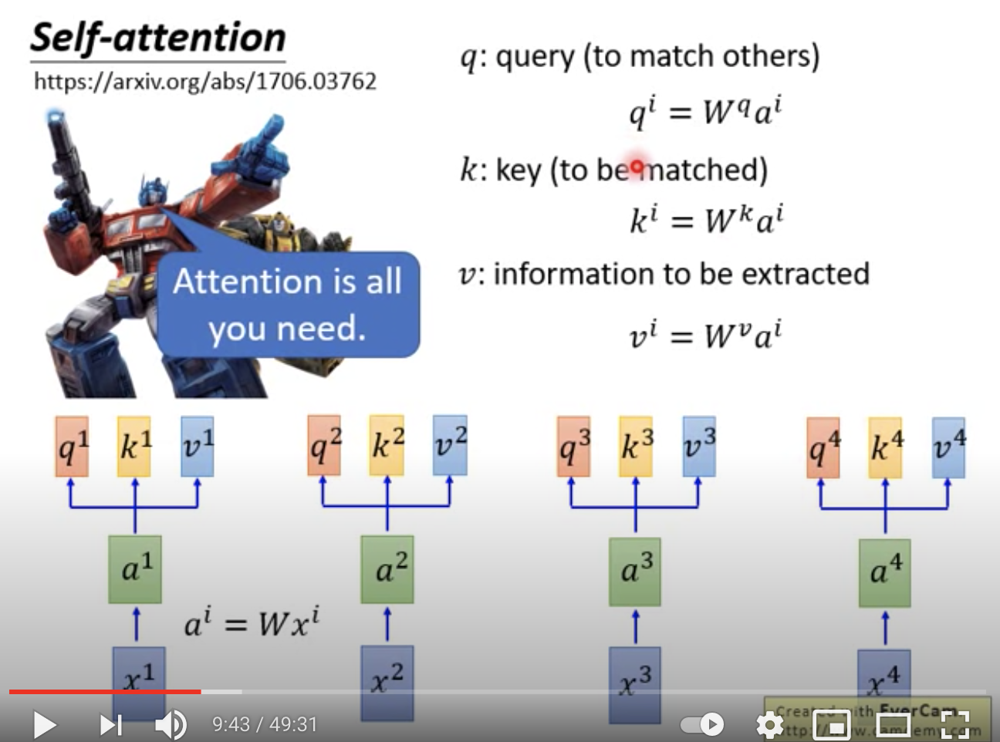
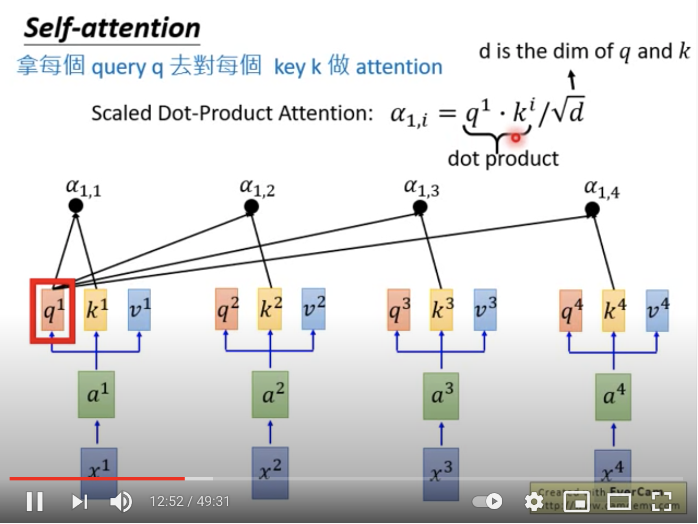

You can try to replace any thing that has been done by RNN with self-attention.

self-attention

q : query (to match others)
$$
q^i = W^q a^i
$$

k : key (to be matched)
$$
k^i = W^k a^i
$$

v : information to be extracted
$$
v^i = W^v a^i
$$

拿每个query q 去对每个key k 做attention
