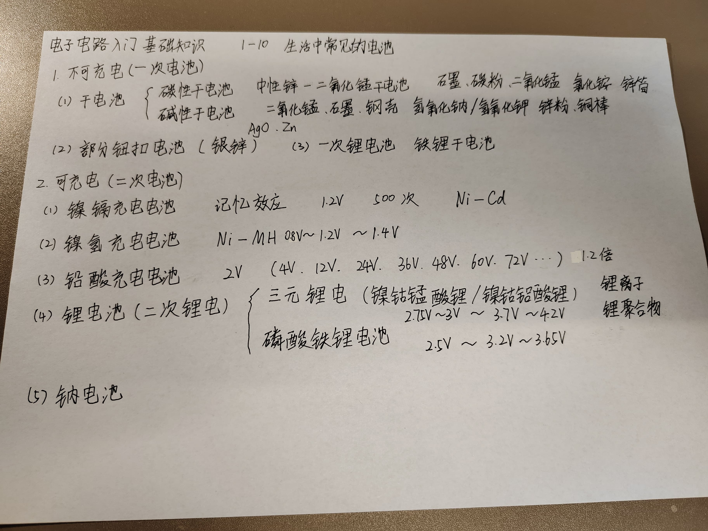

# 1 不可充电（一次电池）

## 1.1 干电池
### 碳性干电池
### 碱性干电池

## 1.2 部分钮扣电池（银锌）

## 1.3 一次锂电池（铁锂干电池）

# 2 可充电（二次电池）

## 2.1 镍镉充电电池
因为镉有污染，这种电池基本被淘汰了。

## 2.2 镍氢充电电池

## 2.3 铅酸充电电池

## 2.4 锂电池（二次锂电）
锂电池是目前能量密度最高的。

### 三元锂电
对低温耐受更好。北方适合用三元锂电，掉电慢。

### 磷酸铁锂电池
对高温耐受更好。

## 2.5 钠电池

