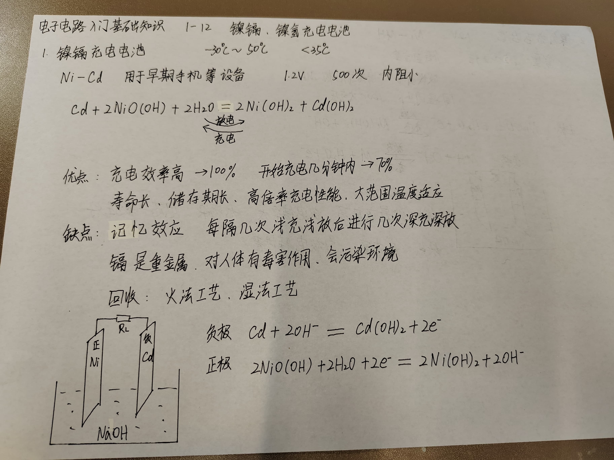
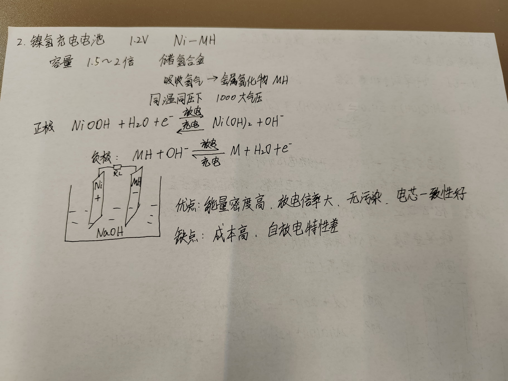

# 1 镍镉充电电池($Ni-Cd$)（淘汰了）

用于早期手机等设备。1.2V，500次，内阻小。

- 优点：
  - 充电效率高-》100%，开始充电内分钟内-》70%。
  - 寿命长，储存期长
  - 高倍率充电性能
  - 大范围温度适应
- 缺点
  - 记忆效应：每隔几次浅充浅放后进行几次深充深放。
  - 镉是重金属，对人体有毒害，会污染环境
  - 回收：火法工艺、湿法工艺

# 2 镍氢充电电池

化学自放电
物理自放电

