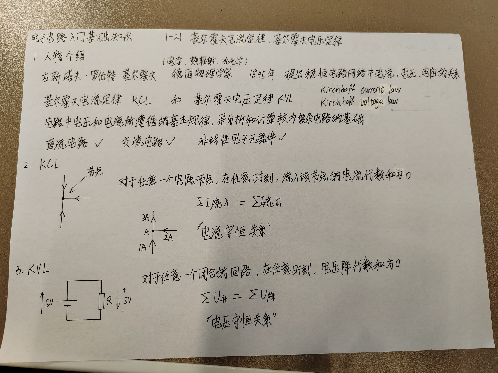
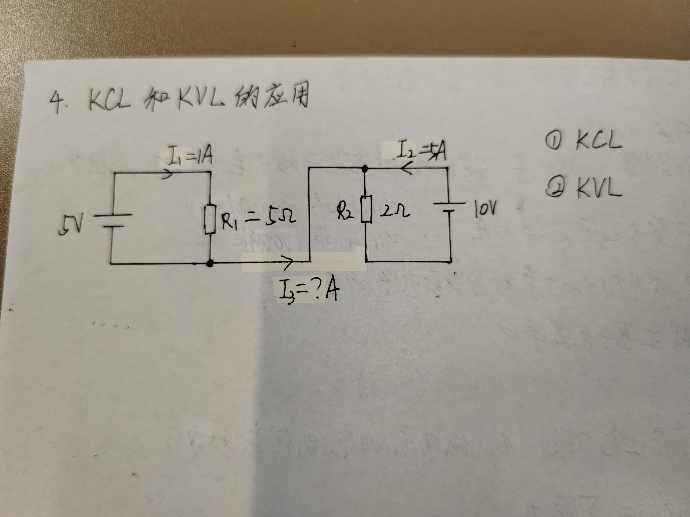

# 1 人物介绍

# 2 KCL（基尔霍夫电流定律，Kirchhoff Current Law）
对于任意一个电路节点，在任意时刻，流入该节点的电流代数和为0。
电流守恒关系。

# 3 KVL（基尔霍夫电压定律，Kirchhoff Voltage Law）
对于任意一个闭合的回路，在任意时刻，电压降代数和为0。
电压守恒关系。

# 4 KCL和KVL的应用

中间导线不构成回路，因此没有电。

