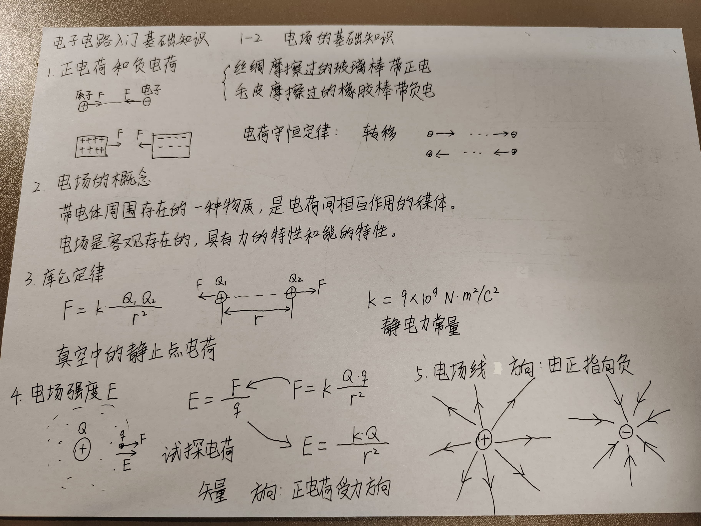

## 1.2 电场的基础知识

### 1 正电荷和负电荷
### 2 电场的概念
带电体周围存在的一种物质，是电荷相互作用的媒体。
电场是客观存在的，具有力的特性和能的特性。

### 3 库仑定律
概念：相对于惯性系静止的两个点电荷间的静电力服从的规律。
特点：
（1）大小相等方向相反，并且沿着他们的连线；同号电荷相斥，异号电荷相吸。
（2）大小与各自的电荷q1及q2成正比，与距离r的平方成反比。
$$
F = k \frac{Q_1 Q_2}{r^2}
$$

静电力常量：
$$
k = 9 \times {10^9} N \dot m^2 / C^2
$$

### 4 电场强度E
$$
E = \frac{F}{q}
$$

$$
E = \frac{k \cdot Q}{r^2}
$$

### 5 电场线
方向：由正指向负

### 6 匀强电场

### 7 电势 $\phi$
电势能 W
$$
\Delta W = F \cdot \Delta x
$$

电压就是电势差
$\phi_A - \phi_B = ?$