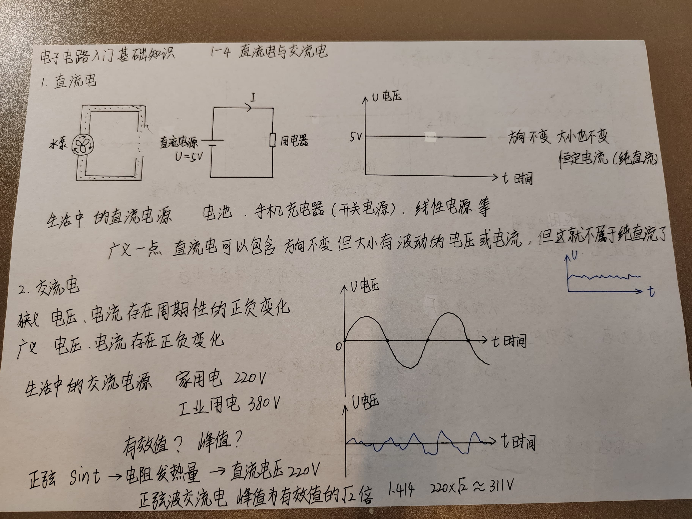
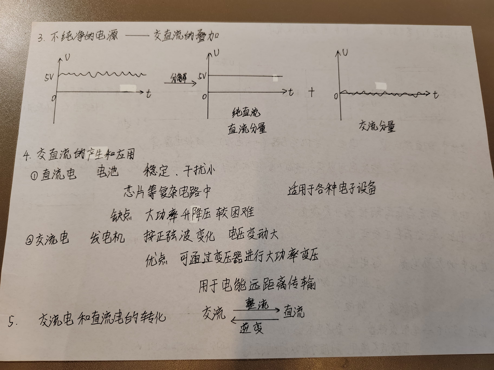

1-4 直流电与交流电
___

# 1 直流电
生活中的直流电源
- 电池
- 手机充电器（开关电源）
- 线性电源

广义一点，直流电可以包含方向不变，但大小有波动的电压或电流，但这就不属于纯直流了。

# 2 交流电
* 狭义：电压、电流存在周期性的正负变化。
* 广义：电压、电流存在正负变化。

生活中的交流电源：
* 家用电 220V
* 工作用电 380V

正弦$\sin t$ -> 电阻发热量 -> 直流电压 220V 
正弦波交流电，峰值为有效值的$\sqrt 2 = 1.414$倍。

$$
220 \times \sqrt 2 \approx 311 V
$$

电容要考虑一瞬间的电压是否把电容击穿而导致损坏。

重要概率：
周期：重复波形的长度。(0.02s)
频率：周期的倒数。单位：HZ（赫兹）(50 HZ)

# 3 不纯净的电源——交直流的叠加

# 4 交直流的产生和应用
## 4.1 直流电
电池：稳定、干扰小
芯片等复杂电路中。
缺点：大功率升降压较困难。
适用于各种电子设备。

## 4.2 交流电
发电机：按正弦波变化，电压变化大。
优点：可通过变压器进行大功率变压。
用于电能远距离传输。 

# 5 交流电和直流电的转化
交流 ----整流----> 直流
直流 ----逆变----> 交流

