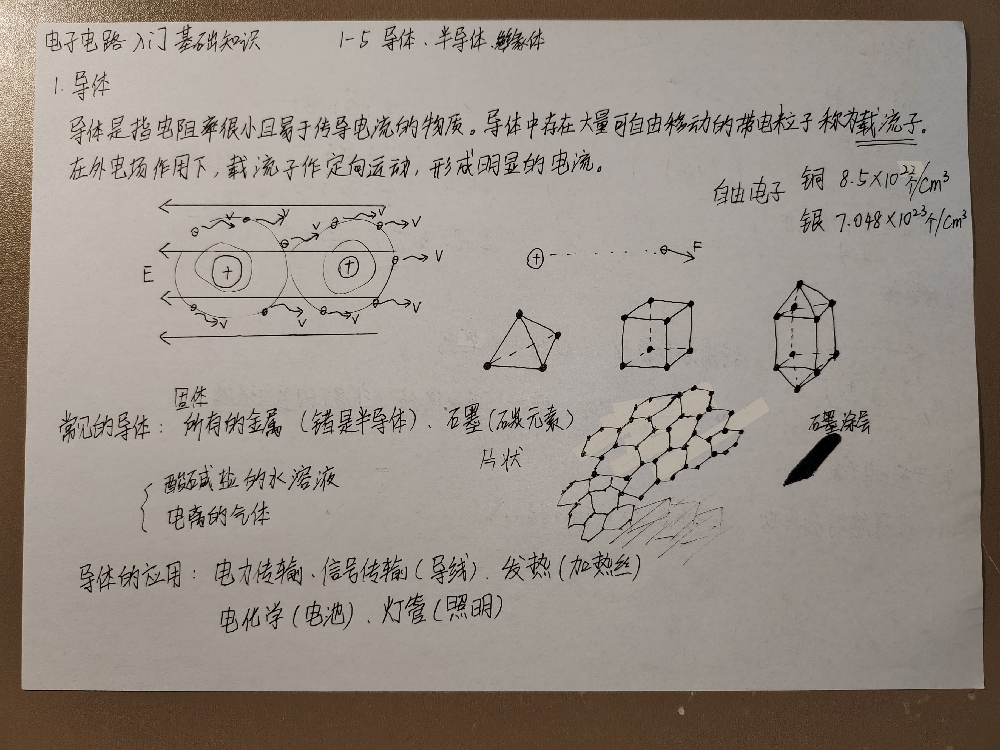
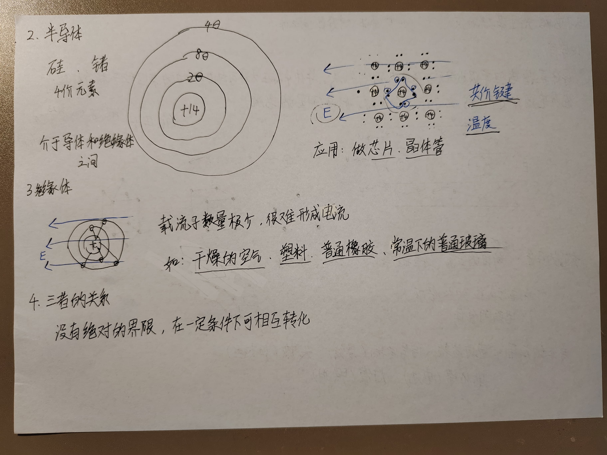

# 1 导体
导体是指电阻率很小且易于传导电流的物质。导体中存在大师可自由移动的带电粒子称为载流子。在外电场作用下，载流子作定向运动，形成明显的电流。

自由电子：
- 铜 $8.5 \times 10^{22} 个/cm^3$
- 银 $7.048 \times 10^{23} 个/cm^3$

常见的导体：
- 所有的金属（锗是半导体）
- 石墨（碳元素）
- 酸碱盐的水溶液
- 电离的气体

导体的应用：
- 电力传输
- 信号传输（导线）
- 发热（加热丝）
- 电化学（电池）
- 灯管（照明）

# 2 半导体
硅、锗 4价元素。
介于导体和绝缘体之间。

共价键：相邻原子共享电子，形成稳定结构。

应用：
- 芯片
- 晶体管

# 3 绝缘体

载流子数量极少，很难形成电流

如：干燥的空气、塑料、普通橡胶、常温下的普通玻璃

# 4 三者的关系
没有绝对的界限，在一定条件下可相互转化。
