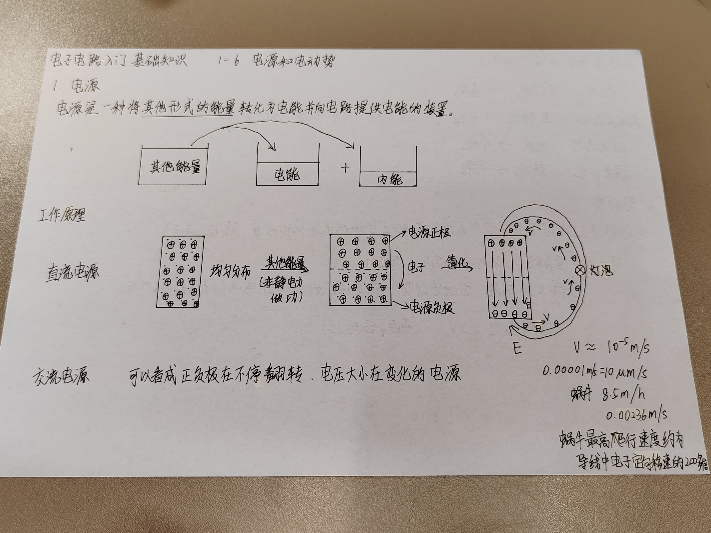
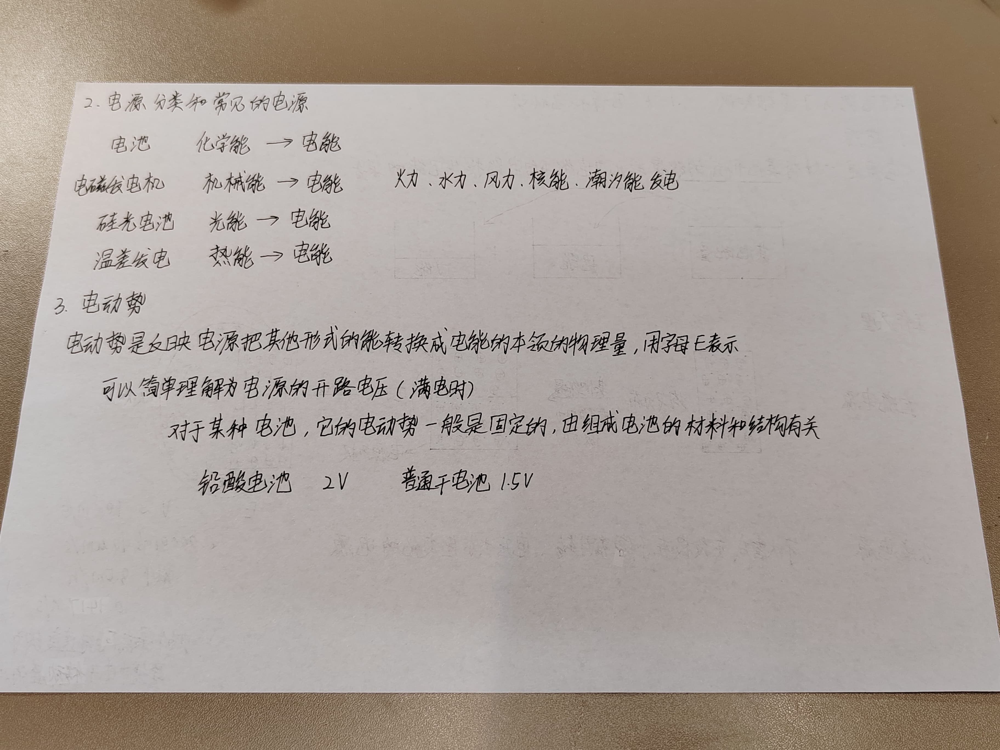

# 1 电源
电源泉是一种将其他形式的能量转化为电能并向电路提供电能的装置。

## 工作原理
### 直流电源
电子的运动速度很慢，但为什么电灯一下子就亮了。因为电场是瞬间建立的。

### 交流电源
可以看成正负极在不停翻转，电压大小在变化的电源。

# 2 电源分类和常见的电源
- 电池：化学能-》电能
- 电磁发电机：机械能-》电能。（火力、水力、风力、核能、潮汐能发电，本质上都是）
- 硅光电池：光能-》电能
- 温差发电：热能-》电能

# 3 电动势

电动势是反映电源把其他形式的能转成电能的本领的物理量，用字母E表示。
可以简单的理解为电源的开路电压（满电时）。
对于某种电池，它的电动势一般是固定的，由组成电池的材料和结构有关。

- 铅酸电池：2V
- 普通干电池：1.5V

