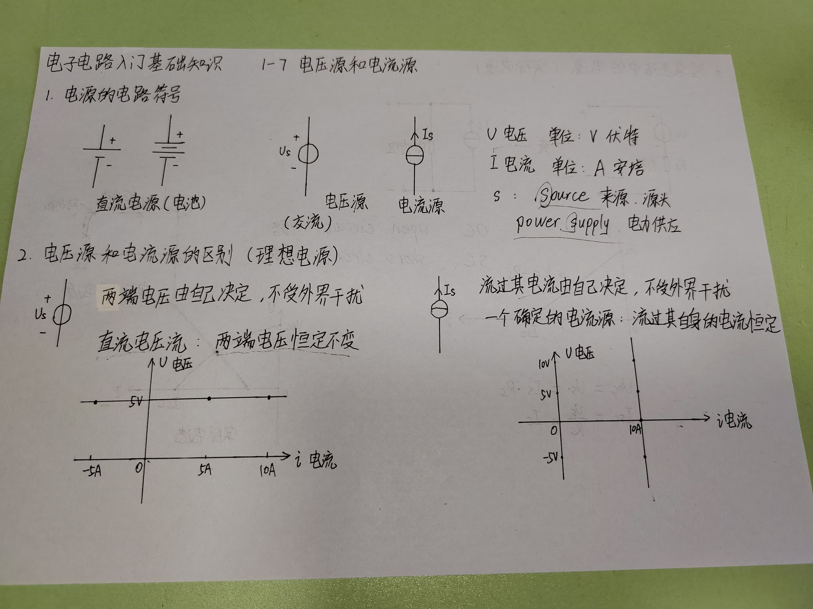
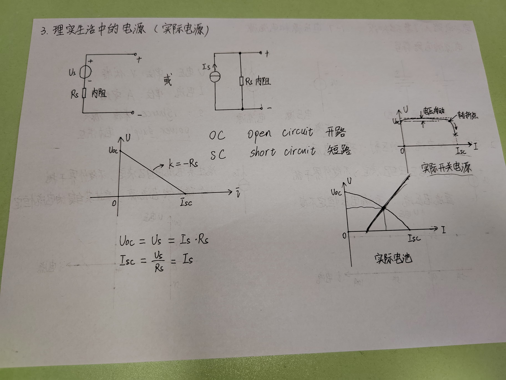

# 1 电源的电路符号

U 电压 单位：V 伏特

I 电流 单位：A 安培

- S
  - source 来源，源头
  - power supply 电力供应

# 2 电压源和电流源的区别（理想电源）

## 2.1 电压源
两端电压由自己决定，不受外界干扰。
直流电压流：两端电压恒定不变。

## 2.2 电流源
流过流由自己决定，不受外界干扰。
一个确定的电流源：流过其自身的电流恒定。

# 3 现实生活中的电源（实际电源）

- OC open circuit 开路
- SC short circuit 短路

短路一般是不允许出现的，可能会破坏电源。

$$
U_{OC} = U_s = I_s \cdot R_s
$$

$$
I_{SC} = \frac{U_s}{R_s} = I_s
$$