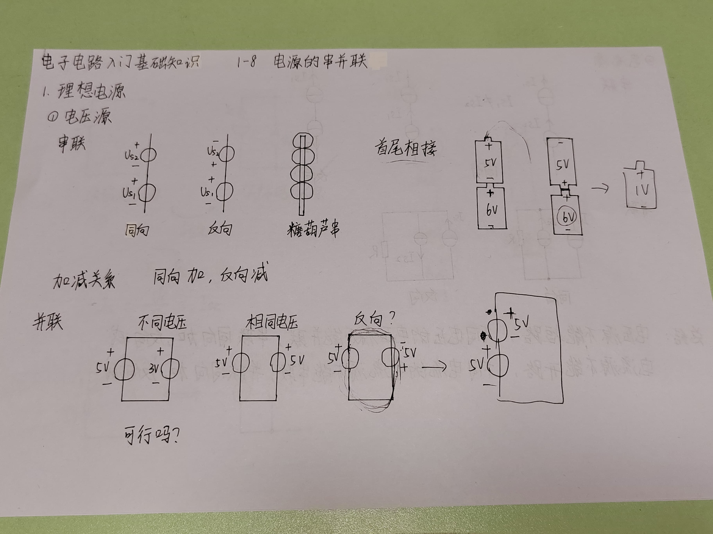
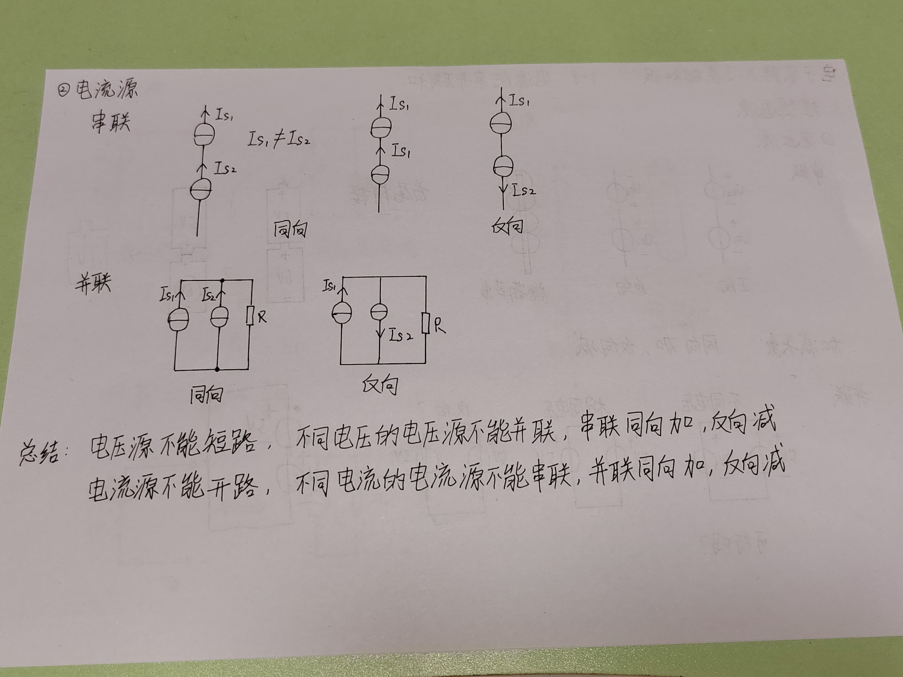
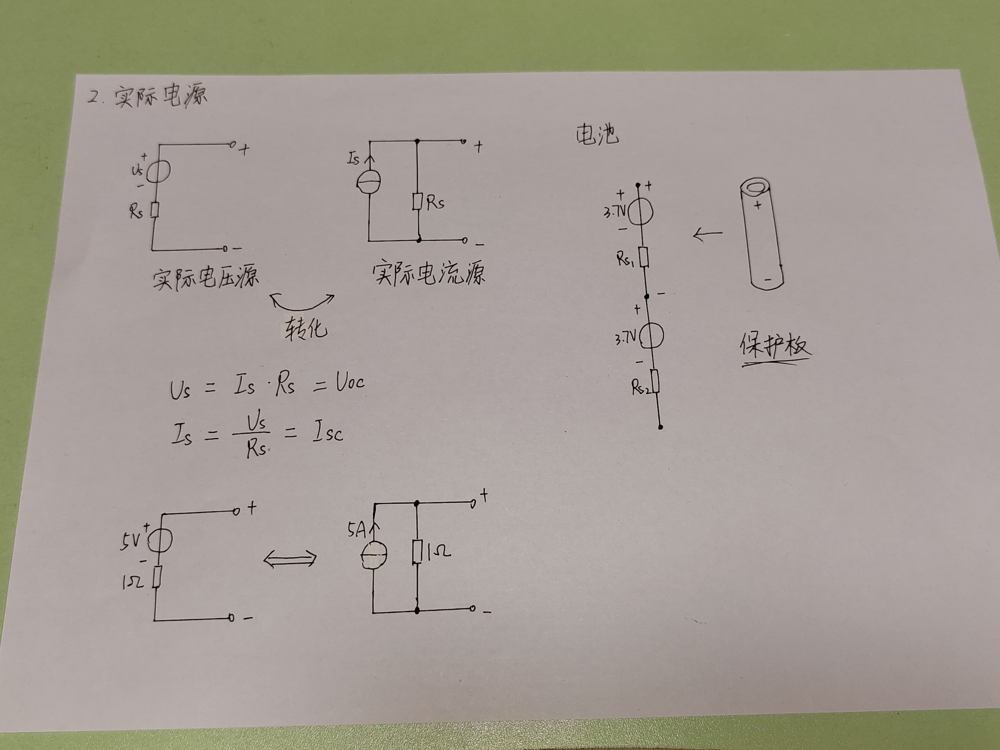

# 1 理想电源

## 1.1 电压源
### 串联（首尾相接）

加减关系，同向加，反向减。

### 并联（一般不会考虑电压源的并联）
- 不同电压：短路
- 相同电压：
- 反向：两个电源都短路。

## 1.2 电流源
### 串联
- 不同电流源串联：不行
- 相同电流源泉串联：可行，但无意义。
- 反向：

### 并联
- 同向
- 反向

## 1.3 总结
电压源不能短路，不同电压的电压源不能并联，串联同向加，反向减。

电流源不能开路，不同电流的电流源不能串联，并联同向加，反向减。

# 2 实际电源

$$
U_{OC} = U_s = I_s \cdot R_s
$$

$$
I_{SC} = \frac{U_s}{R_s} = I_s
$$

