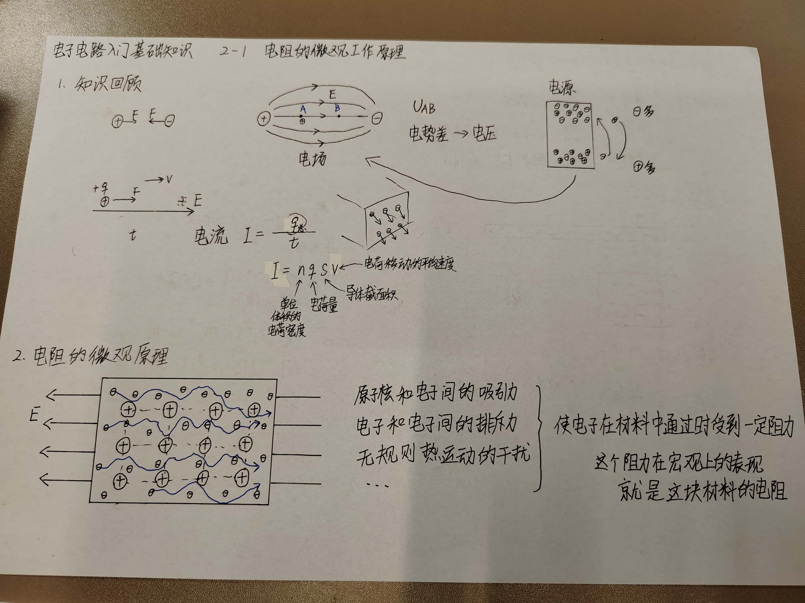
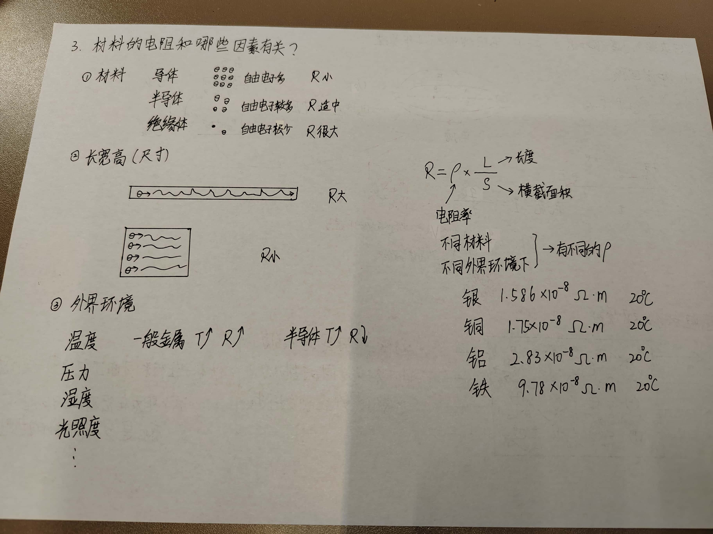

# 1 知识回顾

电流：
$$
I = \frac {q_总} t
$$

$$
I = nqsv
$$
- n: 单位体积电荷密度
- q：电荷量
- s：导体截面积
- v：电荷移动的平均速度

# 2 电阻的微观原理
由于
（1）原子核和电子间的吸引力；
（2）电子和电子间的排斥力；
（3）无规则热运动的干扰；
使得电子在材料 中通过时受到一定阻力，这个阻力在宏观上的表现就是这块材料的电阻。

# 3 材料的电阻和哪些因素有关？

## 3.1 材料
## 3.2 长宽高
## 3.3 外界环境

$$
R = \rho \times \frac L S
$$

- $\rho$ 电阻率
- $L$   长度
- $S$   横截面积

