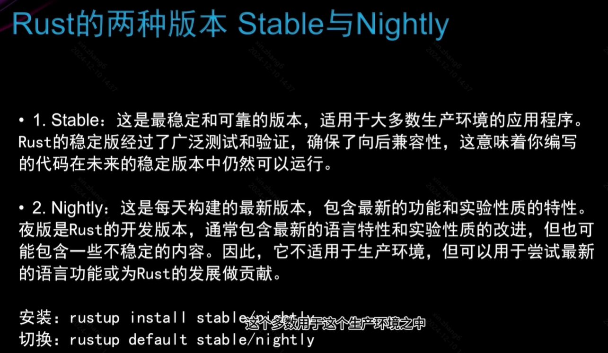

```bash
# 更新rust
rustup update

# 卸载
rustup self uninstall

# 添加组件
rustup component add rustfmt

# 查看版本
rustup --version

# 在浏览器打开本地文档
rustup doc
```




```bash
rustc --version
```
- 结果格式：rustc x.y.z (abcabcabc yyyy-mm-dd)
- 会显示最新稳定版的：版本号、commit hash、commit日期


