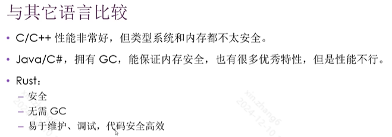
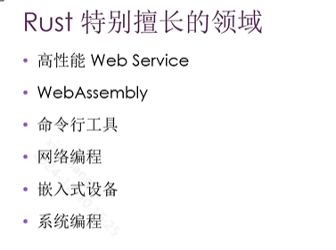
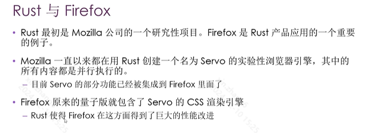
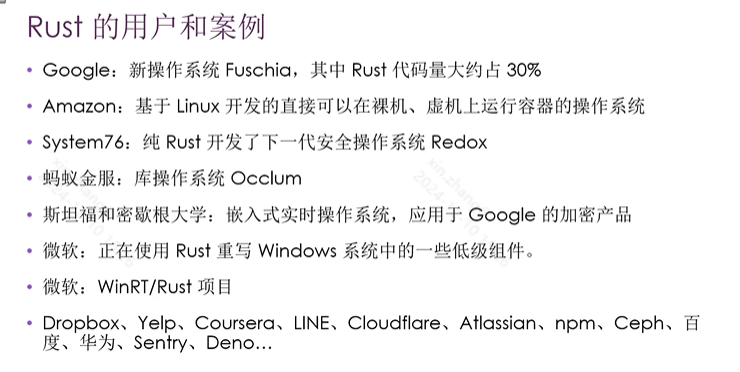
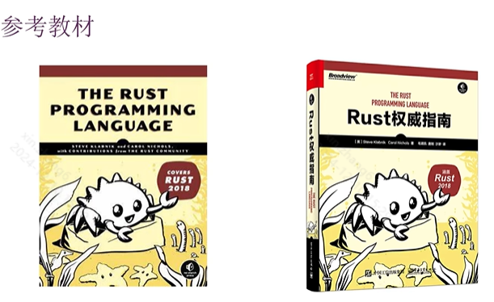
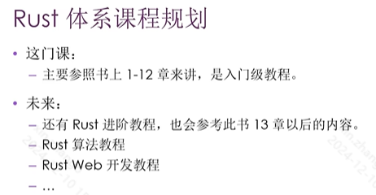
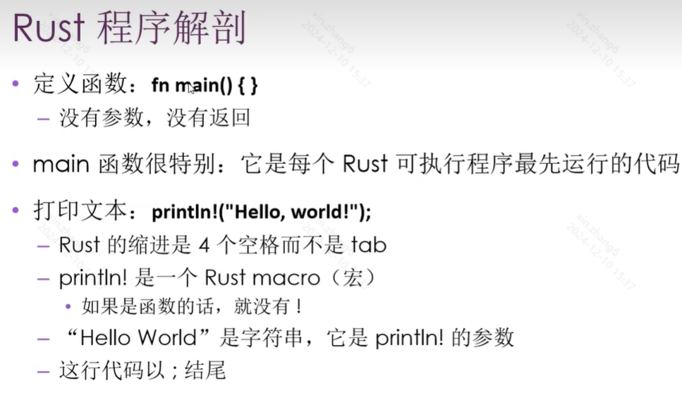
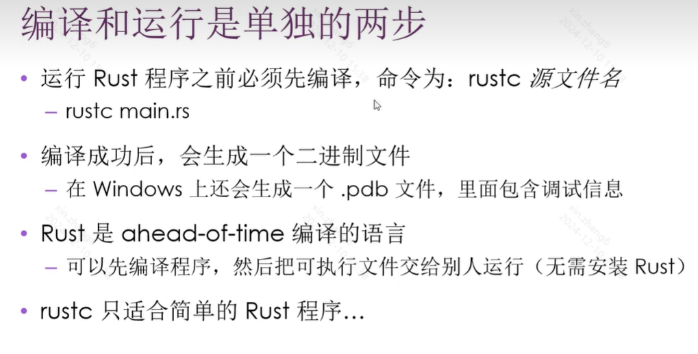

# 为什么要使用Rust

# 与其他语言比较

# Rust擅长的领域

# rust与Firefox

# rust有用户与案例

# Rust的优点
- 性能
- 安全性
- 无所畏惧的并发

# Rust的缺点
难学

# 注意
Rust有很多独有的概念，它们和现在大多主流语言都不同
所以学习Rust必须从基础概念一步一步学，否则会懵。

# 参考教材

# Rust体系课程规划

# 第一个rust程序解析

# 编译和运行是单独的两步

