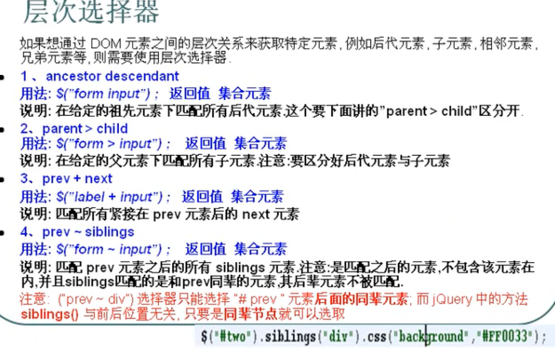

jQuery选择器

选择器是jQuery的根基，在jQuery中，对事件处理，遍历DOM和Ajax操作都依赖于选择器

jQuery选择器的优点：
- 简洁的写法
- 完善的事件处理机制


```javascript
$('#id');       // 等价于
document.getElementById("id");

$("tagName");   // 等价于
document.getElementsByTagName("tagName");
```

- 选择器（9个）
  - 内容
  - 可见性
  - **基本**
    - class
    - element 根据给定的元素名匹配所有元素
    - id
    - selector1, selector2, selectorN
    - 通配符
  - 子元素
  - 层级
  - 属性
  - 简单
  - 表单
  - 表单对象属性


# 1 基本选择器
- `#id`
  - 用法：`$("#myDiv")`
  - 返回值：单个元素的组成的集合
- element
  - 用法：`$("div")`
  - 返回值：集合元素
- class
  - 用法：`$(".myClass")`
  - 返回值：集合元素
- `*`
  - 用法：`$("*")`
  - 返回值：集合元素
- selector1, selector2, selectorN
  - 用法：`$("div.span.p.myClass")`
  - 返回值：集合元素

# 2 层次选择器




