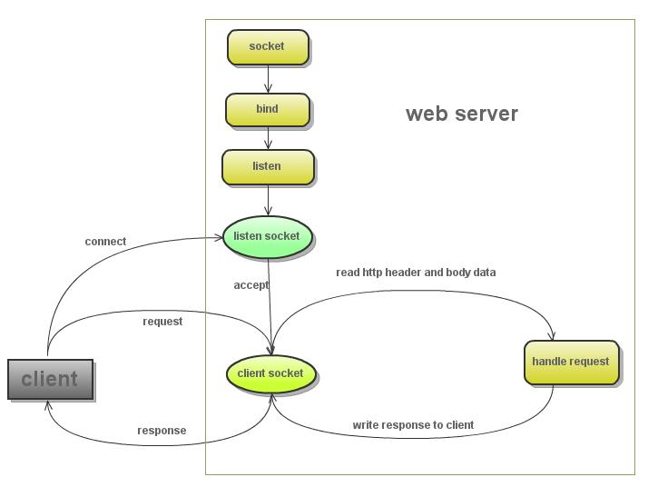

[《零基础学Python》第二版   为做网站而准备](http://wiki.jikexueyuan.com/project/start-learning-python/301.html)

# 分析 Hello
```
python hello.py
```
然后在浏览器中打开：http://localhost:8000
还可以：
```
$ curl http://localhost:8000/
Hello, welcome you to read: www.itdiffer.com 

$ curl http://localhost:8000/?greeting=Qiwsir
Qiwsir, welcome you to read: www.itdiffer.com 
```

# WEB 服务器工作流程

1. 创建 listen socket, 在指定的监听端口, 等待客户端请求的到来
2. listen socket 接受客户端的请求, 得到 client socket, 接下来通过 client socket 与客户端通信
3. 处理客户端的请求, 首先从 client socket 读取 http 请求的协议头, 如果是 post 协议, 还可能要读取客户端上传的数据, 然后处理请求, 准备好客户端需要的数据, 通过 client socket 写给客户端

# 引入模块
```
import tornado.httpserver
import tornado.ioloop
import tornado.options
import tornado.web
```
这四个都是 Tornado 的模块，在本例中都是必须的。它们四个在一般的网站开发中，都要用到，基本作用分别是：

1. tornado.httpserver：这个模块就是用来解决 web 服务器的 http 协议问题，它提供了不少属性方法，实现客户端和服务器端的互通。Tornado 的非阻塞、单线程的特点在这个模块中体现。
2. tornado.ioloop：这个也非常重要，能够实现非阻塞 socket 循环，不能互通一次就结束呀。
3. tornado.options：这是命令行解析模块，也常用到。
4. tornado.web：这是必不可少的模块，它提供了一个简单的 Web 框架与异步功能，从而使其扩展到大量打开的连接，使其成为理想的长轮询。


```
from tornado.options import define, options
define("port", default=8000, help="run on the given port", type=int)
```
在这里通过 tornado.options.define() 定义了访问本服务器的端口，就是当在浏览器地址栏中输入 http:localhost:8000 的时候，才能访问本网站，因为 http 协议默认的端口是 80，为了区分，我在这里设置为 8000。


# 定义请求-处理程序类
```
class IndexHandler(tornado.web.RequestHandler):
    def get(self):
        greeting = self.get_argument('greeting', 'Hello')
        self.write(greeting + ', welcome you to read: www.itdiffer.com')
```
所谓“请求处理”程序类，就是要定义一个类，专门应付客户端（就是你打开的那个浏览器界面）向服务器提出的请求（这个请求也许是要读取某个网页，也许是要将某些信息存到服务器上），服务器要有相应的程序来接收并处理这个请求，并且反馈某些信息（或者是针对请求反馈所要的信息，或者返回其它的错误信息等）。

于是，就定义了一个类，名字是 IndexHandler，当然，名字可以随便取了，但是，按照习惯，类的名字中的单词首字母都是大写的，并且如果这个类是请求处理程序类，那么就最好用 Handler 结尾，这样在名称上很明确，是干什么的。

类 IndexHandler 继承 tornado.web.RequestHandler,其中再定义 get() 和 post() 两个在 web 中应用最多的方法的内容（关于这两个方法的详细解释，可以参考：HTTP GET POST 的本质区别详解，作者在这篇文章中，阐述了两个方法的本质）。

在本例中，只定义了一个 get() 方法。

用 greeting = self.get_argument('greeting', 'Hello') 的方式可以得到 url 中传递的参数，比如
```
$ curl http://localhost:8000/?greeting=Qiwsir
Qiwsir, welcome you to read: www.itdiffer.com 
```
就得到了在 url 中为 greeting 设定的值 Qiwsir。如果 url 中没有提供值，就是 Hello.


# main() 方法
if __name__ == "__main__",这个方法跟以往执行 Python 程序是一样的。

tornado.options.parse_command_line(),这是在执行 tornado 的解析命令行。在 tornado 的程序中，只要 import 模块之后，就会在运行的时候自动加载，不需要了解细节，但是，在 main（）方法中如果有命令行解析，必须要提前将模块引入。

# Application 类
```
app = tornado.web.Application(handlers=[(r"/", IndexHandler)])
```
将 tornado.web.Application 类实例化。这个实例化，本质上是建立了整个网站程序的请求处理集合，然后它可以被 HTTPServer 做为参数调用，实现 http 协议服务器访问。Application 类的__init__方法参数形式：
```
def __init__(self, handlers=None, default_host="", transforms=None,**settings):
    pass
```
在一般情况下，handlers 是不能为空的，因为 Application 类通过这个参数的值处理所得到的请求。例如在本例中，handlers=[(r"/", IndexHandler)]，就意味着如果通过浏览器的地址栏输入根路径（http://localhost:8000 就是根路径，如果是 http://localhost:8000/qiwsir，就不属于根，而是一个子路径或目录了），对应着就是让名字为 IndexHandler 类处理这个请求。

通过 handlers 传入的数值格式，一定要注意，在后面做复杂结构的网站是，这里就显得重要了。它是一个 list，list 里面的元素是 tuple，tuple 的组成包括两部分，一部分是请求路径，另外一部分是处理程序的类名称。注意请求路径可以用正则表达式书写(关于正则表达式，后面会进行简要介绍)。举例说明：
```
handlers = [
    (r"/", IndexHandlers),              #来自根路径的请求用 IndesHandlers 处理
    (r"/qiwsir/(.*)", QiwsirHandlers),  #来自 /qiwsir/ 以及其下任何请求（正则表达式表示任何字符）都由 QiwsirHandlers 处理
]
```
注意

在这里我使用了 r"/"的样式，意味着就不需要使用转义符，r 后面的都表示该符号本来的含义。例如，\n，如果单纯这么来使用，就以为着换行，因为符号“\”具有转义功能（关于转义详细阅读《字符串(1)》），当写成 r"\n" 的形式是，就不再表示换行了，而是两个字符，\ 和 n，不会转意。一般情况下，由于正则表达式和 \ 会有冲突，因此，当一个字符串使用了正则表达式后，最好在前面加上'r'。

关于 Application 类的介绍，告一段落，但是并未完全讲述了，因为还有别的参数设置没有讲，请继续关注后续内容。

# HTTPServer 类
实例化之后，Application 对象（用app做为标签的）就可以被另外一个类 HTTPServer 引用，形式为：
```
http_server = tornado.httpserver.HTTPServer(app)
```
HTTPServer 是 tornado.httpserver 里面定义的类。HTTPServer 是一个单线程非阻塞 HTTP 服务器，执行 HTTPServer 一般要回调 Application 对象，并提供发送响应的接口,也就是下面的内容是跟随上面语句的（options.port 的值在 IndexHandler 类前面通过 from...import.. 设置的）。
```
http_server.listen(options.port)
```
这种方法，就建立了单进程的 http 服务

# IOLoop 类
```
tornado.ioloop.IOLoop.instance().start()
```
这句话，总是在__main()__的最后一句。表示可以接收来自 HTTP 的请求了。
